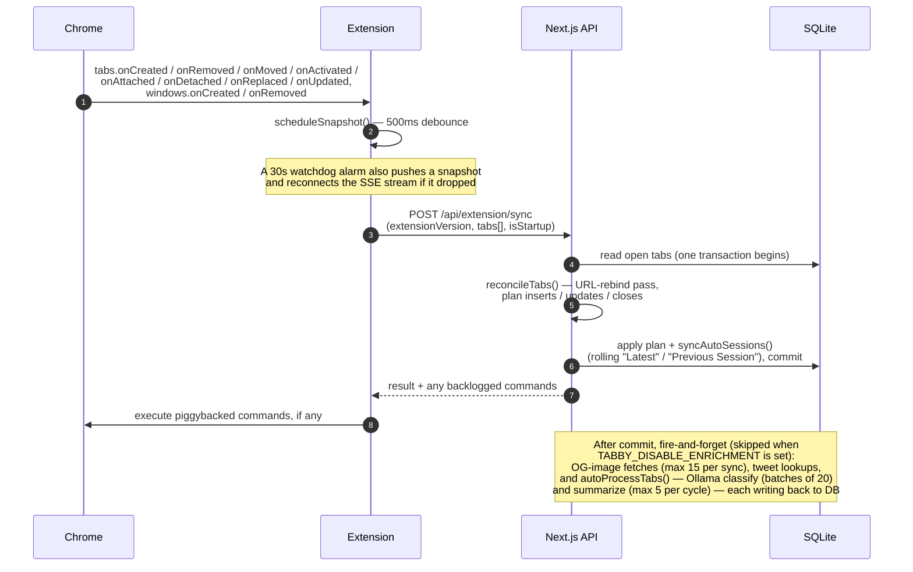
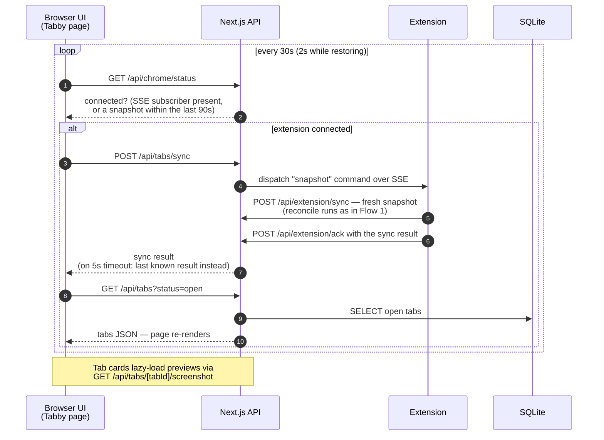
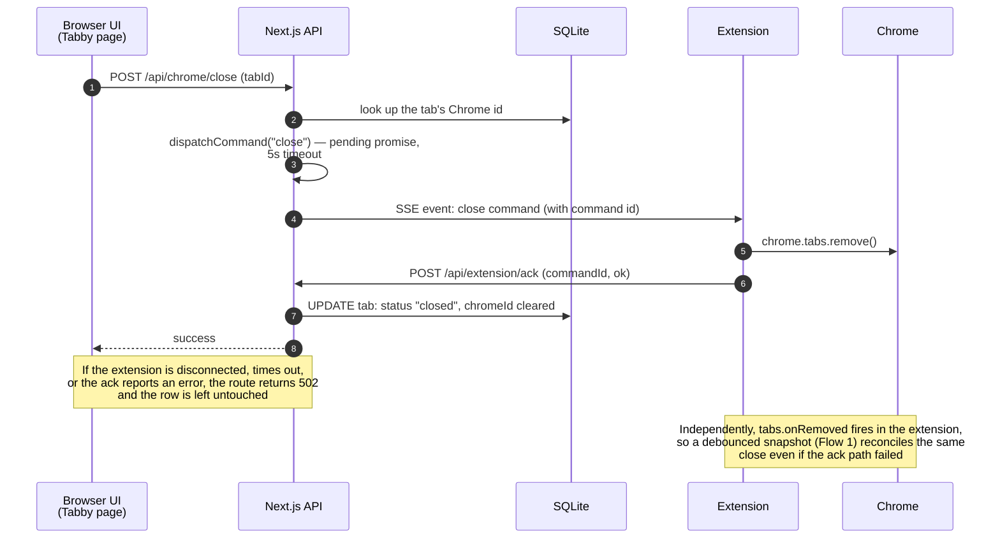

# Architecture

How a browser event becomes a row in the database, and how a click in the Tabby UI becomes an action in Chrome. Four actors appear throughout:

- **Chrome** — the browser itself: tab and window events, and the `chrome.tabs` API.
- **Extension** — the Tabby Connector ([`extension/background.js`](../extension/background.js)), a Manifest V3 service worker.
- **API** — the Next.js app's route handlers under [`app/api/`](../app/api/), running on Bun.
- **DB** — SQLite via Drizzle ORM + `bun:sqlite` ([`lib/db/schema.ts`](../lib/db/schema.ts)): WAL mode, migrations applied on boot from `lib/db/migrations`, location set by `DATABASE_PATH`.

Three distinct channels connect them:

1. **Extension → server** is plain HTTP: snapshots to `POST /api/extension/sync`, command results to `POST /api/extension/ack`, previews to `POST /api/extension/screenshot`.
2. **Server → extension** is a Server-Sent Events stream (`GET /api/extension/events`) that pushes commands (`focus` / `close` / `open` / `discard` / `snapshot`). Each command carries an id; the extension acks it, resolving a pending promise on the server ([`lib/extension/bridge.ts`](../lib/extension/bridge.ts)) with a 5-second timeout. Commands dispatched while no stream is connected sit in a backlog and piggyback on the next snapshot response.
3. **Browser UI → server** is ordinary polling. The Tabby page never opens an SSE connection — it refetches on a timer.

## Flow 1: A tab changes in Chrome

Every tab and window event funnels into one debounced snapshot push. The server diffs the snapshot against the database in a single transaction, then kicks off enrichment in the background.

Two side notes on this flow:

- **Restore lock** — while a session restore is reopening tabs, `POST /api/extension/sync` short-circuits: it records the report and returns backlogged commands without running the reconcile, so each reopened tab doesn't trigger a full diff mid-restore.
- **Previews** — separately from snapshots, tab activation starts a 1.5s timer, then `chrome.tabs.captureVisibleTab` posts a JPEG to `POST /api/extension/screenshot`, which lands in the image file cache that `GET /api/tabs/[tabId]/screenshot` serves to the UI.

## Flow 2: Viewing the Tabby main page

The dashboard ([`app/page.tsx`](../app/page.tsx)) is fully client-side. [`components/providers/sync-provider.tsx`](../components/providers/sync-provider.tsx) polls on an interval (default 30s, configurable via `/api/settings`; 2s while a session restore is in progress). Note the inversion inside `POST /api/tabs/sync`: the server asks the *extension* for fresh state by dispatching a `snapshot` command over the same bridge used for tab actions.

Grouping and sorting happen client-side; only the search box reaches the server (a SQL `LIKE` on tab titles in `GET /api/tabs`).

## Flow 3: Closing a tab from the UI

Tab actions never touch Chrome directly — they run through the command bridge. `close` is shown here; `focus` (`POST /api/chrome/focus`) and `open` (`POST /api/chrome/open`) follow the same shape.

## Key files

| File | Role |
|------|------|
| [`extension/background.js`](../extension/background.js) | Event listeners, snapshot debounce, SSE client, command execution, previews |
| [`lib/extension/bridge.ts`](../lib/extension/bridge.ts) | SSE subscribers, command dispatch/backlog, pending-ack promises, restore lock |
| [`lib/chrome/sync.ts`](../lib/chrome/sync.ts) | `syncTabsFromList` transaction + enrichment kickoff; `syncTabs` snapshot request |
| [`lib/chrome/reconcile.ts`](../lib/chrome/reconcile.ts) | Pure snapshot-vs-DB diff planner (URL-rebind pass lives here) |
| [`lib/chrome/actions.ts`](../lib/chrome/actions.ts) | focus/close/open/discard wrappers over `dispatchCommand` |
| [`components/providers/sync-provider.tsx`](../components/providers/sync-provider.tsx) | The UI polling loop (status → sync → refetch) |
| [`lib/db/schema.ts`](../lib/db/schema.ts) | Drizzle schema: `tabs`, `groups`, `tabs_to_groups`, `sessions`, `session_tabs`, `settings` |

For the full route list and environment variables, see the [API Reference](../README.md#api-reference) and [Environment Variables](../README.md#environment-variables) sections of the README.
